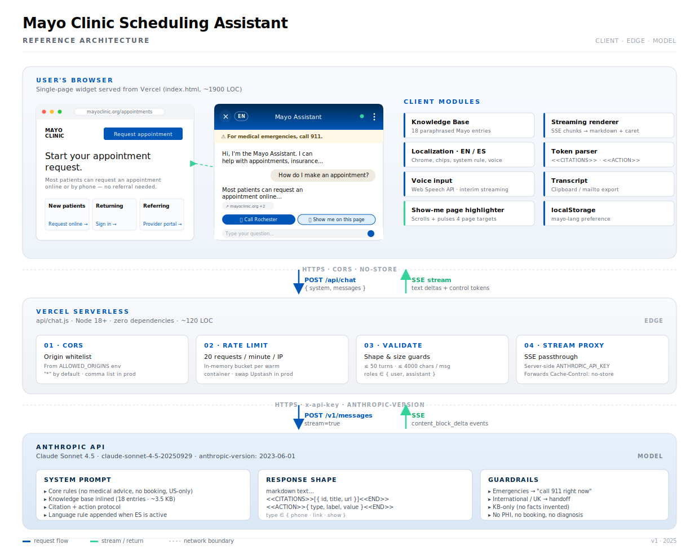
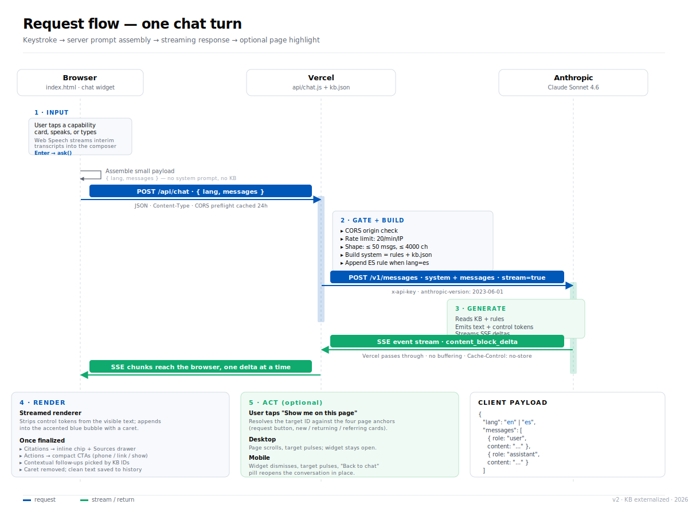

# Mayo Clinic Scheduling Assistant — Architecture

A single-page chat assistant that helps U.S. Mayo Clinic patients with
appointment scheduling, billing, insurance, and locations. Grounded in a
small paraphrased knowledge base, runs against Claude Sonnet 4.5 through
a thin Vercel proxy.

## At a glance

| | |
|---|---|
| **Surface** | One HTML file (`index.html`, ~1900 LOC) — page + widget + client modules |
| **Edge** | Vercel serverless function (`api/chat.js`, ~120 LOC, zero deps) |
| **Model** | Claude Sonnet 4.5 (`claude-sonnet-4-5-20250929`), streaming SSE |
| **Hosting** | Vercel Hobby tier (free for stakeholder demos) |
| **Languages** | English + Spanish, toggled at runtime |
| **State** | In-conversation only; language preference in `localStorage` |
| **Auth** | None (server-side API key is the only secret) |

## System architecture



Three layers, each with a clear responsibility and a thin contract
between them.

### Client (the browser)

A single HTML file ships everything the user touches:

- **Mock Mayo page** — hero, three intake cards, top nav with logo
  and "Request appointment" CTA. The cards and the nav button each
  have a stable `id` so the assistant can address them by name.
- **Chat widget** — a slide-up panel on desktop and a full-screen
  takeover on mobile. FAB collapses it; close + safe-area + body
  scroll-lock + return-pill handle the edge cases.
- **Client modules**, all in the same script tag:
  - **Knowledge Base** — 18 paraphrased entries from mayoclinic.org,
    inlined into the system prompt at request time.
  - **L10N** — EN/ES table for every visible string, starter chip,
    contextual follow-up, and voice-recognition locale.
  - **Streaming renderer** — reads SSE chunks, strips control
    tokens, appends text into the active bubble with a caret.
  - **Token parser** — extracts `<<CITATIONS>>` and `<<ACTION>>`
    blocks from the finalized text.
  - **Voice input** — Web Speech API; interim transcripts stream
    into the composer; language flips with the toggle.
  - **Show-me highlighter** — scrolls a page target into view and
    pulses a Mayo-blue ring; on mobile dismisses the widget first
    and surfaces a "Back to chat" pill.
  - **Transcript** — builds plain text, writes to clipboard or
    opens `mailto:` with subject + body.
  - **Storage** — `localStorage` retains the language choice.

### Edge (Vercel serverless)

`api/chat.js` is intentionally small. It does four things, in order:

1. **CORS** — allows the configured origins (or `*` by default).
2. **Rate limit** — 20 requests per minute per IP in an in-memory
   bucket. Resets when the warm container is recycled.
3. **Validate** — payload must have a `messages` array with at most
   50 turns, each role ∈ `{user, assistant}` and content ≤ 4000
   chars.
4. **Stream proxy** — forwards to Anthropic with the server-side
   `ANTHROPIC_API_KEY` and passes the SSE body straight back to the
   browser. `Cache-Control: no-store` on every response.

The API key never reaches the browser.

### Model (Anthropic)

Claude Sonnet 4.5 with the standard messages API and `stream=true`.
The system prompt is rebuilt per request and contains:

- **Core rules** — no medical advice, no booking, no PHI, U.S.
  patients only, emergency routing, citation requirement.
- **Knowledge base** — all 18 entries inlined as `[kb-XXX] title /
  URL / content` blocks.
- **Action protocol** — three valid CTA types (`phone`, `link`,
  `show`) with example syntax, and the exact four valid target IDs
  for `show`.
- **Language rule** — appended only when ES is active; instructs
  the model to respond in formal *usted* Latin American Spanish
  while keeping control tokens, URLs, and phone numbers intact.

## Request lifecycle



One chat turn, end to end:

1. **Input** — user types or speaks; voice transcripts stream live
   into the composer; pressing Enter (or tapping send) calls
   `ask()`.
2. **Build payload** — the client assembles
   `{ system: buildSystemPrompt(lang), messages: history }` and
   `POST`s it to `/api/chat`.
3. **Gate** — Vercel checks CORS, rate-limits the caller, validates
   the shape, and injects the server-side API key.
4. **Generate** — Anthropic reads the system prompt + KB, emits text
   and control tokens, streams them as SSE deltas.
5. **Render** — the browser appends each delta into the active
   bubble. Once the stream finishes, control tokens are parsed
   out: citations become chips and a Sources drawer; actions
   become CTAs; contextual follow-ups are picked from the
   citation IDs.
6. **Act** *(optional)* — if the user taps "Show me on this page,"
   the page scrolls to the target element and pulses a highlight
   ring. On mobile the widget dismisses first and a return pill
   appears.

## Control protocol

The model and the client agree on three control tokens embedded in
plain text. The client strips them from the visible message and acts
on them after the stream finishes.

### Citations

Every substantive answer ends with:

```
<<CITATIONS>>[{"id":"kb-001","title":"…","url":"https://…"}]<<END>>
```

The client picks the first citation as the inline chip label
(`mayoclinic.org +2`) and surfaces the rest in an expandable drawer.

### Actions (CTAs)

Zero or more action tokens follow:

```
<<ACTION>>{"type":"phone","label":"Call Rochester","value":"507-538-3270"}<<END>>
<<ACTION>>{"type":"link","label":"Request online","value":"https://…"}<<END>>
<<ACTION>>{"type":"show","label":"Show me on this page","value":"page-new-patients-card"}<<END>>
```

| `type` | Renders as | Effect |
|---|---|---|
| `phone` | Filled blue button | `tel:` link, mobile-native |
| `link` | Outlined pill | Opens external URL in new tab |
| `show` | Outlined pill with eye icon | Scrolls + pulses a page element |

Valid `show` targets are listed verbatim in the system prompt, so
the model can't invent fake IDs.

## Configuration

| Env var | Required | Default | Notes |
|---|---|---|---|
| `ANTHROPIC_API_KEY` | yes | — | Vercel project setting |
| `CLAUDE_MODEL` | no | `claude-sonnet-4-5-20250929` | Override per deploy |
| `ALLOWED_ORIGINS` | no | `*` | Comma-separated for prod |

## Security & privacy

- The Anthropic API key lives only on the Vercel edge — never on
  the wire to the browser.
- Per-IP rate limit prevents casual abuse from a single client.
- `Cache-Control: no-store` on every API response keeps chat
  bodies out of intermediate caches.
- System prompt forbids PHI: the assistant refuses to ask for or
  reason over medical history, conditions, or medications.
- No telemetry beyond Vercel's standard function logs.

## Features

### Brand & visual
- Mayo logo as inline SVG (stacked **MAYO CLINIC** wordmark + three-
  shield emblem with center-shield occlusion)
- Source Serif 4 + Inter pairing (closest free match to Mayo's
  proprietary Publico + MayoSans)
- Design-system token palette from the Mayo brand guidelines
- Gradient chat header with hairline top highlight
- Ghost-circle icon buttons, outlined lang pill

### Conversation
- Token-by-token streaming with thinking dots → caret → finalized
- Markdown rendering (lists, bold, paragraphs)
- Inline citation chips + expandable Sources drawer
- Contextual follow-up chips, picked by citation IDs with keyword
  + generic fallbacks; deduped against already-asked questions
- 18-entry KB grounding; system prompt forbids invention beyond it
- Out-of-scope routing for international and UK patients

### Direct action
- Phone CTA (`tel:`)
- External link CTA (mayoclinic.org pages)
- "Show me on this page" — scrolls + highlights four real page
  targets (Request appointment button, New / Returning / Referring
  cards)
- Mobile: dismiss + spotlight + return pill

### Multimodal
- Voice input via Web Speech API (Chrome, Edge, Safari iOS 14.5+)
- Interim transcripts stream live into the composer
- Speech locale flips with the language toggle
- Permission-denial fails silently; browsers without
  `SpeechRecognition` (Firefox) hide the mic button

### Localization
- EN ↔ ES toggle in the header
- Flips title, status, placeholder, safety banner, disclaimer,
  menu, starter chips, follow-ups, speech locale, system prompt
- Existing messages keep their original language; only chrome
  and future replies switch
- Choice persists in `localStorage`

### Mobile
- Full-screen takeover from the bottom edge
- No scrim, no shadow — focused mode
- iOS safe-area inset handling (notch, home indicator)
- Body scroll-lock while open
- Viewport meta tag + `viewport-fit=cover`

### Trust & safety
- Pinned 911 emergency banner
- "AI can make mistakes" disclaimer under composer
- Thumbs-up / thumbs-down feedback per reply (placeholder for
  pipeline integration)
- All assertions cite a knowledge base entry

### Demo conveniences
- Kebab menu with **Copy transcript** and **Email transcript**
- Toast confirmation, click-outside / Escape to dismiss
- Cold-start suggestion chips that auto-hide after first send

## Tech choices & tradeoffs

| Choice | Why | Tradeoff |
|---|---|---|
| Single HTML file | Easiest possible deploy; one upload | No build step means no module splitting |
| Inline KB | Fits well below the prompt limit; deterministic grounding | Won't scale past a couple hundred entries |
| In-memory rate limit | Zero infra to set up | Resets on cold start; swap Upstash Redis in prod |
| Web Speech API | Browser-native, no transcription service | Firefox unsupported; quality varies by OS |
| Streaming SSE passthrough | Snappy perceived latency | Edge function counts towards Vercel's invocation quota |
| `mailto:` for email | Works without an email API | Body length is capped (~1800 chars in Outlook/Gmail) |
| `localStorage` for lang | One-line persistence | Per-browser; not portable across devices |

## What is *not* in scope

This is a stakeholder demo, not a production system. Things that
would be required before real-patient deployment:

- **Authentication** — Mayo SSO / patient portal integration
- **PHI handling** — log redaction, audit trails, BAA with the
  model provider
- **Compliance review** — HIPAA, accessibility (WCAG 2.2 AA),
  state-by-state telehealth boundaries
- **Persistent rate limiting** — Redis/Upstash, not in-memory
- **Booking actions** — the assistant currently directs to phone
  numbers and links; a real version would hand off to the
  appointment system with prefilled fields
- **Deeper KB** — 50–100 entries minimum to feel substantial; the
  current 18 are enough to demo the patterns but not to answer
  the long tail
- **Telemetry** — feedback votes are wired in the UI but don't
  ship anywhere
- **Spanish content KB** — the system prompt translates on the fly;
  a production version should grade Spanish output against
  Mayo-approved translations

## File map

```
.
├── index.html              # Mock page + chat widget + all client modules
├── api/chat.js             # Vercel serverless proxy (streaming)
├── package.json            # type: module, Node 18+, zero deps
├── vercel.json             # Cache-Control: no-store on /api/*
├── README.md               # 10-minute deploy guide
├── ARCHITECTURE.md         # this document
└── docs/
    ├── architecture.svg    # layered system view
    └── request-flow.svg    # one-turn sequence diagram
```
